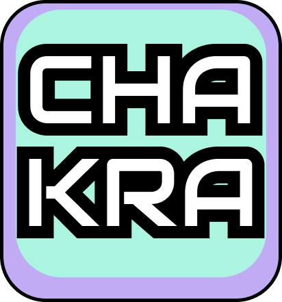
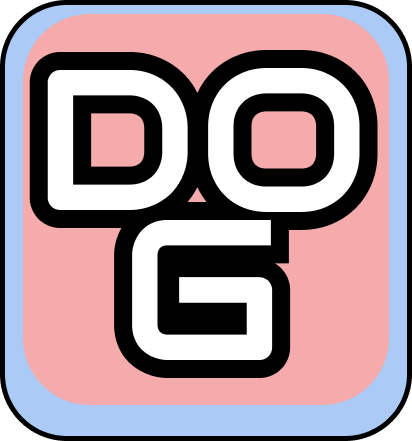
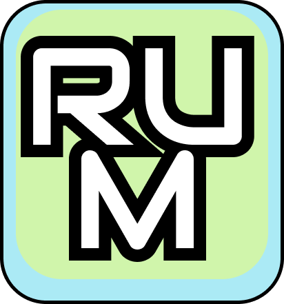

## Contributing to RUM 😄

Hey there!!! Welcome!! Thanks for considering to contribute to the RUM (Run Your Models). Recently RUM is created on the ideology to manage many models and keep the structure simple than complex. I built idea upon how I viewed the RAG system and how I can make it reusable and control the client's call through registered func. But now the RUM is basically becoming framework by including chakra, dog, paint, stack I am going to expand this as much as I can if you find it helpful and something unique you can go for it and understand the status.

---

## Status 💡

### </img> 
**Core:** `listen-to-req` -> `find-the-subscriber` -> `pass-the-result`

* **chakra.go:** Implements the core functionality.
* **main.go:** Implements the motivation, flow & guide.

---

### </img>
**Core:** `push-the-policies` -> `on-parkDog` -> `start-ticker & init-report` -> `on-done or on-bark` -> `write report & stop ticker` -> `trigger the chakra` -> `chakra delivers the package to Pakkum`

* **apis:** Client side core functionality.
* **dog:** Main-struct & registration, unregisteration, reset methods.
* **example:** Usage and best practice methods.
* **health:** Current performance health track.
* **hub:** Concurrent running app.
* **main.go:** Implements the motivation, flow & guide.
* **monitor.go:** Core implementation of the parkDog.
* **polcies.go:** Core description of the dog to monitor.
* **query.go:** Get queries.
* **record.go:** Log data writing.

---

### </img> 
**Core:** Uses `lipgloss` package to bring creative artwork on the terminal.

* **main.go:** Implements the motivation, flow & guide.
* **styles.go:** Some of the created styles.

---

### </img>
**Core:** Robust way to manage the many models and have full control over.

#### 📁 rum/server
**Core:** `listen to grpc-post` -> `trigger-policy` -> `dispatch-the-results` -> `monitor-performance` -> `trigger-the-paper`

* **budget.go:** Implements the budget management.
* **cluster.go:** Work-in-progress 🚧
* **dispatch.go:** Core to handle the function registry.
* **handler.go:** Implements the manipulation of the stream.
* **hub.go:** Concurrently running fetching the channels and dispatching them to the handlers.
* **kit.go:** Core to handle the describe the profile.
* **light.go:** Internal pub-sub system.
* **main.go:** Implements the motivation, flow & guide.
* **metric.go:** Implements the log data.
* **profile.go:** Core of the idea that stores the created profiles and modification.
* **register:** Generic function that handle the services to be trigger and pass the result as per the func implementation.
* **rum.go:** Base of the idea that uses all the structs and implements the logic.
* **rumio.go:** Provides writer that writes the result and triggers the events.
* **sequence.go:** A simple struct to handle the profile management.
* **server.go:** Implements the server that handles the gRPC calls -> keeps the hub awake.
* **service.go:** Implements the description of the profile events.
* **slate.go:** Still trying to figure 😅.
* **store.go:** Implements the search-engine and profile storage.
* **time-format.go:** Implements the description of the events & profile management.

#### 📁 rum/client
**Core:** `trigger-grpc-server`

* **client.go:** Implements the client that calls the server.

---

### 🔍 search-manager
**Core:** Implements RAG search engine.
* **engine.go:** Main entry point of the search engine.
* **helpers.go:** implements algorithms.
* **main.go:** Implements the motivation, flow & guide.
* **search-manager.go:** Core implementation of the Milvus search engine.
---

### </img> 
* **main.go:** Implements the motivation, flow & guide.
* **stack.go:** Implements the core fundamental stack flow.

---

### 🚀 Quick Start

1.  **Config:** Set the minIO user & pass in the `compose.yml`.
2.  **Run:** Execute `play.bat`.
    * *Note:* In case of error: `"Container RUMminio Error dependency minio failed to start"`, increase the password length and retry with `./play`.
3.  **Result:** Observe how the registered functions actually work.